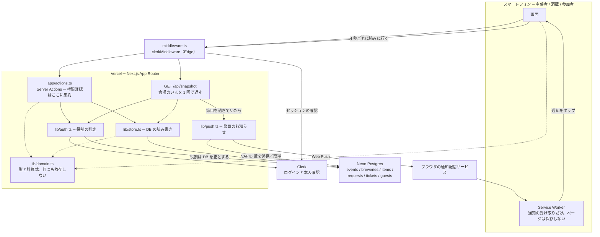
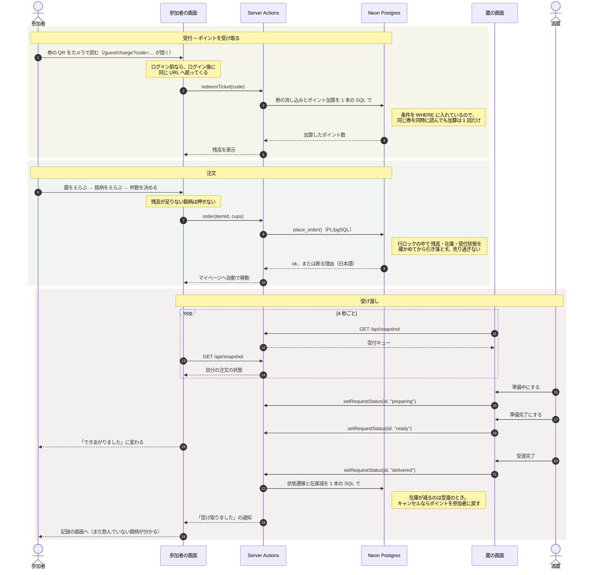

# 佐賀 蔵めぐり

佐賀の酒蔵が集まる**合同試飲イベント**の、受付・在庫・ポイントを 1 つにまとめた
Web サービスです。

**主催者・酒蔵・参加者の 3 者が、同じ画面の情報を共有します。**
どこか 1 台で操作すると、ほかの画面が数秒で追いつきます。

- 参加者は**ブースの前でスマホから注文**し、できあがりを画面で知る
- 酒蔵は**持ち込んだ酒を自分で登録**し、注文を順に片付ける
- 主催者は**在庫・混雑・遅延をひと目で把握**し、券が切れたらその場で増やす

アプリのインストールは要りません。**URL を開くだけ**で、iPhone でも Android でも
同じように使えます。開始・終了などの節目には、画面を閉じていてもお知らせが届きます。

---

## 主催者の方へ ─ 公開するまで

**プログラミングの知識は要りません。**
かかる時間はおよそ **15 分**、費用は **無料の範囲で始められます**。

入口が 2 つあります。**ほとんどの方は A です。**

### A. このリポジトリを配布された方（通常はこちら）

[](https://vercel.com/new/clone?repository-url=https%3A%2F%2Fgithub.com%2Fmidnight480%2Fsaga-sake-event&project-name=saga-sake-event&repository-name=saga-sake-event&env=ORGANIZER_EMAILS&envDescription=%E9%81%8B%E5%96%B6%E3%82%92%E6%8B%85%E5%BD%93%E3%81%99%E3%82%8B%E6%96%B9%E3%81%AE%E3%83%A1%E3%83%BC%E3%83%AB%E3%82%A2%E3%83%89%E3%83%AC%E3%82%B9&envLink=https%3A%2F%2Fgithub.com%2Fmidnight480%2Fsaga-sake-event%2Fblob%2Fmain%2Fdocs%2F%25E3%2583%2587%25E3%2583%2597%25E3%2583%25AD%25E3%2582%25A4%25E6%2589%258B%25E9%25A0%2586.md)

1. 上のボタンを押す
2. GitHub でログイン（無料。持っていなければその場で作れます）
3. **「Repository Name」に、あなたのイベントの名前を入れる**（下記参照）
4. **「ORGANIZER_EMAILS」に、ご自身のメールアドレスを入れる**（下記参照）
5. **「Create」**→ 次の画面で確認してから **「Deploy」**

### B. このリポジトリを自分で持っている方

所有者・共同編集者、または動作確認のために自分のアカウントで試す方はこちらです。
**A の Deploy ボタンは使えません**（同じ名前のリポジトリが 2 つ作れないため）。

1. **<https://vercel.com/new>** を開く
2. 「Import Git Repository」から **`saga-sake-event`** を選び **「Import」**
3. 次の画面で確認してから **「Deploy」**

---

### ⭐ 名前の付け方 ─ ここで入れた名前が、そのまま URL になります

```
Repository Name に  kuramenguri-saga-2026  と入れると
       ↓
https://kuramenguri-saga-2026.vercel.app  が自分のサイトの URL になります
```

短い URL は**世界中で早い者勝ち**です。地域名や年を入れて、自分だけの名前に
してください。使える文字は**小文字の英数字とハイフン**です。

### ⭐ `ORGANIZER_EMAILS` は必ず入れてください

**入れないと「最初にログインした人」が自動で主催者になります。** URL を先に
誰かに開かれると、その人が運営権限を持ってしまいます。

ほかの欄（`DATABASE_URL` など）は**空のまま**で構いません。あとで自動的に入ります。

### ⚠️ Deploy を押す前に、この 3 つを確認してください

| 画面の項目 | 正しい値 |
| --- | --- |
| **Repository** | `midnight480/saga-sake-event` |
| **Git Branch** | `main` |
| **Application Preset** | `Next.js` |

**Application Preset がいちばん分かりやすい目印です。** `Other` と出ていたら、
違うリポジトリを見ています。

---

### 公開したら、必ず別の端末で開けるか確かめてください

Vercel は新しいサイトに既定で鍵（Vercel Authentication）をかけます。
**自分のパソコンは開けるのに、来場者は誰も開けない**という状態になります。

外し方は [デプロイ手順 STEP 5](docs/デプロイ手順.md) にあります。**ここを飛ばすと
URL を配っても誰も使えません。**

### 公開したあとの続き

```
6. できあがった URL を開くと「はじめの設定」画面が出ます
7. 画面の案内どおり、Neon と Clerk を追加する（クリックだけです）
8. 「主催者としてはじめる」を押して、ご自身のメールアドレスで登録
9. イベント設定 → 蔵アカウント → チケットQR の順に進める
```

> 手順の詳細（押す場所を 1 つずつ）→ **[docs/デプロイ手順.md](docs/デプロイ手順.md)**
> うまくいかないとき → **[docs/よくあるトラブル.md](docs/よくあるトラブル.md)**
> 当日の進め方 → **[docs/当日の運営手順.md](docs/当日の運営手順.md)**
> **来場者が 100 人を超えるとき** → **[docs/独自ドメインで本番運用する.md](docs/独自ドメインで本番運用する.md)**

### 公開される URL について

Vercel は 2 つの URL を用意します。短いほうは早い者勝ちですが、**アカウント名
入りの URL は必ず使えます**。画面に表示された URL をそのまま配ってください。

アカウント名が入るぶん、**ほかの主催者が同じ時期に公開しても衝突しません。**

### 公開したあとの自動更新

Vercel は **`main` ブランチ**を見ています。`main` に変更が入るたび、サイトは
自動で作り直されます（1〜2 分）。

---

## かかる費用

| | 無料の範囲 | 超えたら |
| --- | --- | --- |
| Vercel（サイトの置き場所） | 個人利用は無料 | 規模が大きくなったら有料プラン |
| Neon（データの保存） | 無料プランで十分 | 数百人規模なら無料枠で足ります |
| Clerk（ログイン） | 月 10,000 人まで無料 | 来場者がそれ以上なら有料 |

一般的な規模（来場者 数百人・出展 30 蔵）なら、**すべて無料枠に収まります**。

ただし **Clerk は独自ドメインを設定するまで「開発モード」** で動き、その間は
**登録できる人数が合計 100 人まで**に制限されます。100 人を超えるイベントでは
[独自ドメインで本番運用する](docs/独自ドメインで本番運用する.md) をイベント前に
済ませてください（すでにドメインをお持ちなら追加費用はかかりません）。

---

## 当日の流れ

```
開場前   酒蔵が、持ち込んだ銘柄・1杯あたりのポイント・本数を登録
         主催者が、券（1 枚ごとに QR 付き）を刷って受付に置く

開始     時刻になると自動で受付が開く（手動で早めることもできます）

開催中   参加者は受付で券を受け取り、券の QR をカメラで読む → ポイントが入る
         酒蔵をさがして、銘柄を選んでリクエスト（一度に 3 杯まで）
         酒蔵は 準備中 → 準備完了 → 受渡完了 と進める
         参加者は受け取ってから、次のリクエストを出せる
         主催者はダッシュボードで在庫・混雑・遅延を見る

終了     時刻になると自動で受付が閉じる

次の年   イベント設定から「前回の記録を片付ける」
         （酒蔵のアカウントは残るので、配り直す必要はありません）
```

各画面の **「ヘルプ」** タブに、その役割の使い方が入っています。酒蔵と参加者は、
そこから主催者に問い合わせを送れます。

---

## 開発者の方へ

技術スタック: **Next.js 16 (App Router) / React 19 / TypeScript / Tailwind CSS v4 /
Clerk / Neon Postgres**

```bash
npm install
cp .env.example .env.local   # DATABASE_URL と Clerk の鍵を入れる
npm run dev
```

```bash
npm run build       # 本番ビルド（環境変数なしでも通ること）
npm run typecheck   # 型検査
npm run verify:sql  # 実際の Postgres に対する検証
```

- 設計の全体像と判断の理由 → **[DESIGN.md](DESIGN.md)**
- 作業するときの決まり → **[AGENTS.md](AGENTS.md)**

### システムの構成

サーバーを常駐させず、WebSocket も使わない。**3 つの役割の画面が同じ口
（`/api/snapshot`）を 4 秒ごとに読みに行き、同じ数字を見る**という形にしている。
追加の契約も設定も増やさずに、どの端末でも動かすため。



要点は 3 つ。

- **`lib/domain.ts` はどこからも参照されるが、何も参照しない。** 杯数もポイントも
  混雑の判定も、サーバーとブラウザで同じ式を使うことで「画面ごとに数が違う」を防ぐ
- **役割は Clerk のトークンではなく DB から読む。** Clerk は既定で `publicMetadata`
  をトークンに含めないため
- **節目のお知らせは cron ではなく `/api/snapshot` のついでに送る。** Vercel の
  Hobby プランは cron が 1 日 1 回までで、開始 10 分前などの刻みに使えないため

### 当日の流れ（シーケンス）



注文の状態は `accepted`（受付済）→ `preparing`（準備中）→ `ready`（準備完了 受取可）
→ `delivered`（受渡完了）と進み、どの段階からも `cancelled`（キャンセル）にできる。
遷移表そのものは `lib/domain.ts` の `STATUS_FLOW` にある。

### 設計上の要点

- **環境変数が無くてもビルドと起動が成功する。** 主催者が「先にデプロイ、あとから
  設定」できるようにするため。壊すと `/setup` すら開けなくなる
- **主催者に触らせる設定は `ORGANIZER_EMAILS` 1 つだけ。** DB と Clerk の鍵は
  Vercel の連携が入れ、通知の鍵は自動生成し、スキーマは初回アクセス時に自動適用する
- **在庫とポイントは、条件付きの 1 本の SQL か PL/pgSQL 関数で更新する。**
  同時操作で二重に動かないようにするため
- **時刻は必ず日本時間で組み立てる。** サーバーは UTC で動くため
- **iOS / Android のどちらにも依存しない。** 画面幅もスマホに合わせる

---

## ライセンス

[MIT](LICENSE)
