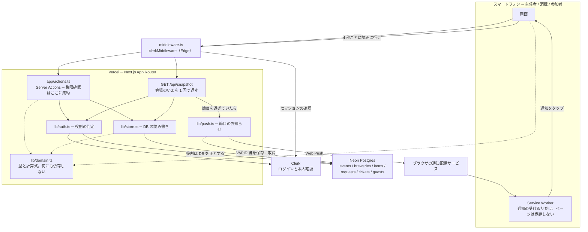
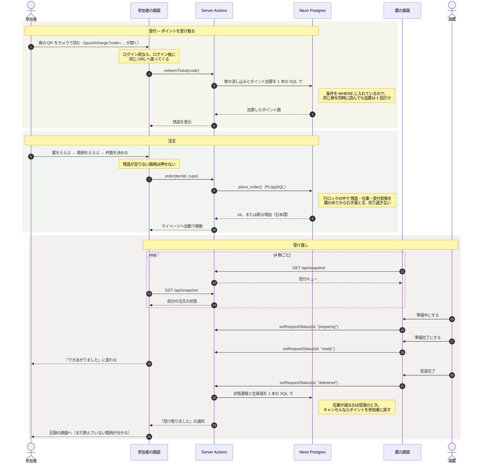

# 開発者向け

技術スタック: **Next.js 16 (App Router) / React 19 / TypeScript / Tailwind CSS v4 /
Clerk / Neon Postgres**

```bash
npm install
cp .env.example .env.local   # DATABASE_URL と Clerk の鍵を入れる
npm run dev
```

```bash
npm run build       # 本番ビルド（環境変数なしでも通ること）
npm run typecheck   # 型検査
npm run verify:sql  # 実際の Postgres に対する検証
```

- 設計の全体像と判断の理由 → **[DESIGN.md](../DESIGN.md)**
- 作業するときの決まり → **[AGENTS.md](../AGENTS.md)**

## システムの構成

サーバーを常駐させず、WebSocket も使わない。**3 つの役割の画面が同じ口
（`/api/snapshot`）を 4 秒ごとに読みに行き、同じ数字を見る**という形にしている。
追加の契約も設定も増やさずに、どの端末でも動かすため。



要点は 3 つ。

- **`lib/domain.ts` はどこからも参照されるが、何も参照しない。** 杯数もポイントも
  混雑の判定も、サーバーとブラウザで同じ式を使うことで「画面ごとに数が違う」を防ぐ
- **役割は Clerk のトークンではなく DB から読む。** Clerk は既定で `publicMetadata`
  をトークンに含めないため
- **節目のお知らせは cron ではなく `/api/snapshot` のついでに送る。** Vercel の
  Hobby プランは cron が 1 日 1 回までで、開始 10 分前などの刻みに使えないため

## 当日の流れ（シーケンス）



注文の状態は `accepted`（受付済）→ `preparing`（準備中）→ `ready`（準備完了 受取可）
→ `delivered`（受渡完了）と進み、どの段階からも `cancelled`（キャンセル）にできる。
遷移表そのものは `lib/domain.ts` の `STATUS_FLOW` にある。

## 設計上の要点

- **環境変数が無くてもビルドと起動が成功する。** 主催者が「先にデプロイ、あとから
  設定」できるようにするため。壊すと `/setup` すら開けなくなる
- **主催者に触らせる設定は `ORGANIZER_EMAILS` 1 つだけ。** DB と Clerk の鍵は
  Vercel の連携が入れ、通知の鍵は自動生成し、スキーマは初回アクセス時に自動適用する
- **在庫とポイントは、条件付きの 1 本の SQL か PL/pgSQL 関数で更新する。**
  同時操作で二重に動かないようにするため
- **時刻は必ず日本時間で組み立てる。** サーバーは UTC で動くため
- **iOS / Android のどちらにも依存しない。** 画面幅もスマホに合わせる
